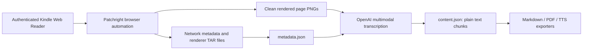
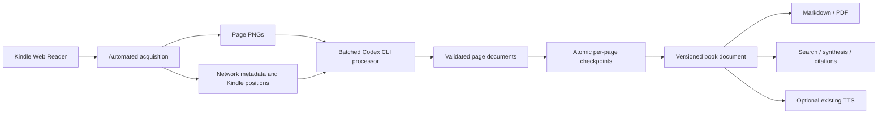

# Kindle AI Export Methodology and Codex CLI Migration

Date: 2026-08-27

## Objective

Retain this repository's effective Kindle Web Reader acquisition method while replacing its general-purpose hosted LLM API call with the locally installed, ChatGPT-authenticated Codex CLI. The replacement should improve fidelity instead of preserving the current plain-text-only boundary: text, semantic formatting, page layout, embedded images, and citation provenance must remain connected to the captured page evidence.

Optional audiobook generation is outside this migration. OpenAI and Unreal Speech TTS remain available because `codex exec` produces structured text, not synthesized audio.

## Existing Methodology

The project is a sequence of directly invoked TypeScript scripts that exchange files under `out/<ASIN>` rather than a packaged application or library. The documented sequence is extraction, transcription, and optional Markdown, PDF, EPUB, or audio export ([README](../../readme.md#usage)).

### Browser and authentication

The extractor launches a visible persistent Chrome context, giving each ASIN its own browser profile under the output directory. It first attempts to reuse an authenticated session and otherwise enters the configured Amazon credentials, requesting a 2FA code through the terminal when needed ([extract-kindle-book.ts](../../src/extract-kindle-book.ts#L45), [extract-kindle-book.ts](../../src/extract-kindle-book.ts#L267)).

The script changes Kindle to Amazon Ember and single-column mode. It records the user's initial printed page, navigates to the inferred content start, automatically clicks through the book, and restores the original page afterward ([extract-kindle-book.ts](../../src/extract-kindle-book.ts#L304), [extract-kindle-book.ts](../../src/extract-kindle-book.ts#L477), [extract-kindle-book.ts](../../src/extract-kindle-book.ts#L624)).

### Network-derived metadata

Successful Kindle responses provide three useful evidence streams:

- `YJmetadata.jsonp` supplies book identity and bibliographic metadata.
- `/service/mobile/reader/startReading` supplies ownership, session, and format information; authentication-sensitive fields are removed before persistence.
- `/renderer/render` returns TAR payloads. The extractor saves and unpacks them, then reads `location_map.json`, `metadata.json`, and `toc.json` to obtain renderer position bounds, position-to-page mappings, and nested TOC position IDs.

These behaviors are implemented in the response listener ([extract-kindle-book.ts](../../src/extract-kindle-book.ts#L121)). TOC entries are flattened without losing depth and mapped from Kindle position IDs to printed pages ([extract-kindle-book.ts](../../src/extract-kindle-book.ts#L385)).

The current code does **not** obtain plain book text directly from these network responses. It reads their navigation metadata and captures the renderer's page image. Direct glyph mapping and richer renderer-asset extraction remain explicit TODOs ([todo.md](../../todo.md#L1)).

### Page capture

Before Kindle's scripts run, the extractor wraps `URL.createObjectURL` and copies every renderer blob before Kindle revokes the temporary URL ([extract-kindle-book.ts](../../src/extract-kindle-book.ts#L226)). The active capture mode retrieves the clean rendered page image without reader chrome, downsamples device pixels to CSS-pixel dimensions, and saves a PNG whose name contains capture index and printed page number ([extract-kindle-book.ts](../../src/extract-kindle-book.ts#L503)).

Each captured page is appended to in-memory metadata and checkpointed to `metadata.json` ([extract-kindle-book.ts](../../src/extract-kindle-book.ts#L551)). However, every new run initializes an empty page list, so the checkpoint does not currently provide interruption recovery ([extract-kindle-book.ts](../../src/extract-kindle-book.ts#L64)).

## Existing Model Boundaries

### Multimodal page transcription

The replaceable LLM boundary is [transcribe-book-content.ts](../../src/transcribe-book-content.ts#L12). For each page it:

1. Reads the PNG and converts it to a base64 data URL.
2. Sends the image to hard-coded `gpt-4.1-mini` through `openai-fetch`.
3. Requests verbatim plain text while explicitly telling the model to ignore embedded images and Markdown.
4. Trims line-edge whitespace and removes a standalone leading page number.
5. Stores only `{index, page, text, screenshot}` in `content.json`.

The API call and prompt are at [transcribe-book-content.ts](../../src/transcribe-book-content.ts#L63). The persisted type has no representation for layout blocks, embedded media, source hashes, processor configuration, confidence, attempts, warnings, or failed pages ([types.ts](../../src/types.ts#L24)).

Sixteen page requests run concurrently. Short refusal messages retry as many as twenty times, while other per-page failures are logged, suppressed, and removed from the final array. This can create a silently incomplete book ([transcribe-book-content.ts](../../src/transcribe-book-content.ts#L58), [transcribe-book-content.ts](../../src/transcribe-book-content.ts#L136)).

### Hosted text-to-speech

The audiobook exporter separately calls OpenAI TTS or Unreal Speech, caches MP3 chunks by configuration/content hash, and concatenates them with ffmpeg ([export-book-audio.ts](../../src/export-book-audio.ts#L64), [export-book-audio.ts](../../src/export-book-audio.ts#L193)). This is media generation rather than document analysis, and Codex CLI is not a replacement for it.

## Fidelity and Provenance Gaps

- The complete page PNG is retained, but embedded images are not extracted as independent assets.
- The transcription prompt intentionally discards rich media and Markdown semantics.
- Markdown and PDF exporters reflow plain text and do not retain original page layout or image placement ([export-book-markdown.ts](../../src/export-book-markdown.ts#L72), [export-book-pdf.ts](../../src/export-book-pdf.ts#L82)).
- `PageChunk` does not contain a source hash, image dimensions, capture timestamp, Kindle start/end position, completion state, or processing provenance.
- `ContentChunk` cannot distinguish headings, paragraphs, quotations, lists, captions, tables, images, footnotes, or page numbers.
- Generated output has no stable citation ID resolving a passage back to ASIN, printed page, Kindle position, and source image.
- The repository declares Vitest but currently has no test/spec files; `pnpm test` runs formatting, linting, and type checking only ([package.json](../../package.json#L17)).

## Codex CLI Feasibility Evidence

The installed `codex-cli 0.147.0` is authenticated through ChatGPT. `codex exec` supports multiple `--image` inputs, `--output-schema`, `--output-last-message`, JSONL events, ephemeral sessions, explicit working directories, and read-only sandboxing.

Two schema-constrained probes used the repository's committed sample page images:

- A single-image run returned a page number, bold heading, paragraph boundaries, alignment, and a truncation warning. After the separately classified page number was excluded, its text exactly matched the repository's reference after whitespace normalization.
- A two-image run consumed 20,250 input tokens versus 19,477 for the one-image run. The second image therefore added only 773 input tokens, demonstrating that multi-page batching amortizes most fixed Codex-agent overhead.
- The first batched page exactly matched the reference. The second differed by one character: Codex read “Nekhebet,” while the repository reference read “Nekhbet.” Visual inspection of the source PNG confirmed Codex was correct.

The probes also exposed production requirements:

- Codex structured outputs accept a narrower subset than generic JSON Schema. A `const` field also needed an explicit `type`, and `uniqueItems` was rejected.
- An invalid schema emitted `turn.failed` in JSONL and produced no result file, but the observed CLI process still exited successfully.
- A robust adapter must therefore require a `turn.completed` event, a present output file, valid JSON, local schema validation, and exact requested/returned page identity. Exit status alone is insufficient.

## Considered Architectures

### 1. One Codex process per page

This is the smallest API replacement, but it retains the weak content contract and pays almost the full Codex-agent input overhead for every page. It is rejected.

### 2. Structured, batched Codex processing

This retains the proven acquisition stage and introduces a testable processor boundary, schema-constrained page documents, batched image processing, per-page checkpoints, rich-media references, and citation provenance. This is the approved direction.

### 3. Port extraction into the existing hybrid-reader system

This would combine two systems before validating the simpler repository's end-to-end path and would reintroduce coupling to the prior collector architecture. It is rejected for this vertical slice.

## Approved Architecture

The approved direction has these constraints:

- Modify this repository as a dedicated fork; do not port it into the earlier hybrid-reader project.
- Keep automated browser navigation and network metadata capture as the acquisition foundation.
- Replace only general-purpose multimodal transcription with non-interactive `codex exec`.
- Default to ordered multi-page batches and one active batch, with configuration overrides.
- Recursively split a failed batch until a problematic page is isolated.
- Treat complete page PNGs as canonical evidence that is never discarded.
- Represent page content as ordered semantic blocks such as heading, paragraph, list item, quote, caption, image, table, footnote, page number, and unknown/other.
- Record visible alignment and emphasis and retain warnings about truncation, ambiguity, or uncertain layout.
- Represent detected non-text media with a description and page-relative region; crop the original page PNG with Sharp when the region is reliable. Never regenerate book artwork.
- Persist atomic per-page results and skip inputs whose source hash and processor configuration are unchanged.
- Produce a versioned canonical book document and a backward-compatible plain-text projection for existing exporters.
- Assign stable citation IDs that resolve to ASIN, capture index, printed page, Kindle position when available, screenshot path/hash, and semantic block.
- Keep OpenAI/Unreal Speech audiobook generation optional and unchanged. `OPENAI_API_KEY` is no longer required for transcription and is needed only when OpenAI TTS is selected.
- Invoke Codex through an argument array without a shell, attach images by absolute path, close stdin, use an empty private working directory, use an ephemeral read-only session, and bound process lifetime and captured diagnostics.

## Remaining Design Work

Before implementation, the following details still require a finalized design and test plan:

- Canonical page/book document schemas and legacy projection.
- Exact citation-ID construction and Kindle-position mapping.
- Media-region representation and crop-validation rules.
- Timeout, retry, batch-splitting, cancellation, and partial-completion state transitions.
- Prompt/schema versioning and cache-key construction.
- Unit-test fakes for Codex process outcomes and an opt-in real-CLI integration test.
- Markdown/PDF behavior for semantic blocks, rich media, warnings, and citations.
