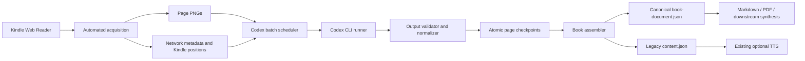

# Codex CLI Book Processing Design

Date: 2026-08-27
Status: Approved for implementation planning
Related research: [Kindle AI Export Methodology and Codex CLI Migration](../../research/2026-08-27-methodology-and-codex-migration.md)

## Purpose

Replace the direct OpenAI multimodal transcription call with the locally installed, ChatGPT-authenticated Codex CLI while improving the output boundary from plain text to a resumable, citation-ready document model that preserves semantic formatting, layout observations, and embedded-media evidence.

This design modifies the `kindle-ai-export` repository as a dedicated fork. It does not port the approach into the earlier hybrid-reader project.

## Scope

The implementation will:

- Retain automated Kindle Web Reader navigation, network metadata capture, and clean page-PNG acquisition.
- Replace general-purpose page-image transcription with non-interactive `codex exec`.
- Process ordered page-image batches through a checked-in structured-output schema.
- Normalize untrusted model output into deterministic page and book documents.
- Preserve full page images as canonical evidence.
- Create best-effort crops for confidently located embedded-media regions without generating replacement artwork.
- Persist atomic per-page checkpoints and resume unchanged work.
- Represent failures explicitly and prevent silent partial export.
- Add deterministic page/block citations resolving to the original screenshot and available Kindle locations.
- Generate the legacy `content.json` projection for existing exporters.
- Update Markdown and PDF export paths to consume the canonical document while preserving rich blocks and citations.
- Keep existing OpenAI and Unreal Speech audiobook generation optional and unchanged.

## Non-goals

- Codex CLI will not replace text-to-speech providers.
- The first implementation will not extract plain book text or original image assets directly from renderer TAR internals.
- It will not guarantee pixel-perfect reconstruction of Kindle typography.
- It will not add search, embeddings, question answering, or synthesis features; it will produce evidence suitable for those consumers.
- It will not require printed-page numbers or exact Kindle position ranges when the acquisition stage cannot derive them. Capture index and screenshot evidence remain mandatory.

## Architecture



### Components

1. **Capture manifest builder** enriches current `metadata.pages` with immutable screenshot evidence: capture ID, hash, dimensions, and available Kindle positions.
2. **Codex CLI runner** owns safe process execution and returns either validated raw batch output or a typed invocation failure.
3. **Batch scheduler** selects uncached pages, invokes the runner, retries classified failures, and recursively splits page-specific failures.
4. **Output validator and normalizer** enforces schema/domain invariants and derives text, paths, hashes, IDs, citations, and media crops locally.
5. **Checkpoint store** atomically writes one success/failure record per expected page and supplies cache hits on later runs.
6. **Book assembler** orders all page records, calculates completeness, emits the canonical document, and creates the legacy projection.
7. **Export adapters** render canonical blocks, media, provenance, and partial-page markers.

Each component will expose a narrow TypeScript interface and avoid top-level side effects so it can be tested independently.

## Artifact Layout

All book-specific artifacts remain under `out/<ASIN>/`:

```text
metadata.json
pages/*.png
page-documents/<capture-id>.json
assets/<capture-id>/<block-id>.png
book-document.json
content.json
processing-state.json
.codex-tmp/<run-id>/<batch-id>/
```

- `metadata.json` remains the acquisition record.
- `page-documents/` contains atomic resumable checkpoints, including typed failures.
- `assets/` contains only local crops derived from canonical page PNGs.
- `book-document.json` is the versioned canonical output.
- `content.json` remains the legacy plain-text projection.
- `processing-state.json` records current/last run state and aggregate counts.
- `.codex-tmp/` is private temporary process storage and is cleaned after each invocation has been converted to a validated result or bounded failure summary.

Book directories containing extracted content use mode `0700`; newly created sensitive JSON and diagnostic files use mode `0600`.

## Data Model

### Capture source

Every expected page has a `PageSource`:

| Field | Meaning |
|---|---|
| `captureId` | Stable zero-padded capture-index ID, such as `c000123` |
| `index` | Zero-based capture order |
| `printedPage` | Kindle printed page when available, otherwise `null` |
| `position` | `{start, end}` Kindle positions when available, otherwise `null` |
| `screenshotPath` | Book-relative canonical PNG path |
| `screenshotSha256` | Lowercase SHA-256 of PNG bytes |
| `width`, `height` | PNG pixel dimensions |
| `rendererBatch` | Renderer TAR identity when known, otherwise `null` |

The capture ID is stable within a captured edition/layout. Screenshot hash and processor configuration determine cache validity.

### Raw Codex output

Codex returns only observations. The checked-in schema requires:

- A schema version.
- Exactly one page object for every requested page ID.
- Ordered blocks for each page.
- Page-level warnings.

Every raw block has:

| Field | Meaning |
|---|---|
| `order` | Zero-based reading order unique within the page |
| `kind` | `heading`, `paragraph`, `list-item`, `quote`, `caption`, `image`, `table`, `footnote`, `page-number`, or `other` |
| `runs` | Ordered verbatim text runs with block-local emphasis |
| `alignment` | `left`, `center`, `right`, `justified`, or `unknown` |
| `indentLevel` | Nonnegative visual indentation level |
| `headingLevel` | Integer 1–6 for headings, otherwise `null` |
| `region` | Normalized integer rectangle in a 0–1000 coordinate space, otherwise `null` |
| `regionConfidence` | `high`, `medium`, `low`, or `unknown` |
| `mediaDescription` | Objective visible-media description, otherwise `null` |
| `caption` | Visible media caption, otherwise `null` |

Text-run emphasis is limited to `bold`, `italic`, `small-caps`, and `unknown`. The local normalizer concatenates runs to derive block and page plain text. Codex never supplies file paths, hashes, citations, cache keys, or processing provenance.

### Normalized page record

Each persisted `page-documents/<capture-id>.json` checkpoint is a discriminated record with shared source and processing data plus one of two states:

- `status: "succeeded"` contains a normalized page document.
- `status: "failed"` contains a typed failure record.

The assembled book uses a broader `BookPageRecord` union. In addition to those persisted states, it may synthesize `status: "pending"` for a page that has no checkpoint or `status: "cancelled"` for an uncheckpointed page when the operator cancels the run. Pending and cancelled records contain their `PageSource` and no invented content.

Processing provenance contains:

- Runner kind `codex-cli`.
- Codex CLI version.
- Requested model name or `cli-default`.
- Prompt, output-schema, and normalizer versions.
- Configuration hash and page cache key.
- Run and batch IDs.
- Total attempts and completion timestamp.

Normalized blocks receive deterministic block IDs, derived plain text, validated layout, optional media assets, and citations.

### Media assets

The full page PNG is always canonical evidence. For an `image` or `table` block, the normalizer creates a crop only when:

- A region is present and entirely inside the normalized page bounds.
- Width and height are each at least 10 normalized units.
- Region confidence is `high` or `medium`.
- The calculated pixel rectangle is nonempty and Sharp produces a readable image.

The asset record contains relative path, MIME type, dimensions, SHA-256, source screenshot hash, pixel crop rectangle, and derivation `page-crop`. Low-confidence or missing regions retain the full-page reference and warning but do not fail transcription.

### Citations

Each block receives a deterministic ID:

```text
knd:<asin>:<edition-hash-12>:<screenshot-hash-12>:<processor-hash-12>:b<zero-padded-order>
```

The edition hash is derived from ASIN and Kindle metadata version. A citation resolves to:

- ASIN and edition version.
- Capture ID/index.
- Printed page and Kindle position range when available.
- Screenshot path and complete SHA-256.
- Block ID, kind, and normalized region.
- Processor configuration hash.

Citation stability is defined for an unchanged source screenshot and processor configuration. Reprocessing under a changed prompt, schema, model, CLI version, or normalizer produces a new processor hash and therefore new citation IDs.

### Canonical book document

`book-document.json` contains:

- `schemaVersion: "1"`.
- Book identity and edition metadata.
- Current processor revision.
- Aggregate status: `complete`, `partial`, `failed`, or `cancelled`.
- Expected, captured, succeeded, failed, and pending counts.
- Every expected page record in capture order, including failures.

The assembler never filters out failed pages.

### Legacy projection

`content.json` remains an array of `{index, page, text, screenshot}` for successful pages. Its `text` is derived from canonical runs, excluding page-number blocks and removing a heading only when it case-insensitively duplicates the matching TOC heading at that page boundary. Canonical blocks remain unchanged.

Because the legacy contract requires a numeric `page`, legacy projection fails with a clear error if any canonical page lacks `printedPage`. The canonical document remains valid and available in that case; the projector never invents a printed-page number.

Legacy projection is written only for complete books unless the operator explicitly enables partial output. Partial projection inserts a visible missing-page marker for every failed page.

## Cache and Resume Semantics

Each page cache key is SHA-256 over a canonical serialization of:

- Screenshot SHA-256.
- Complete prompt contents and prompt version.
- Complete output-schema contents and schema version.
- Codex CLI version.
- Requested model or `cli-default`.
- Normalizer version.

A successful checkpoint is reusable only when the cache key matches. Failed/cancelled checkpoints are never cache hits. A changed page, prompt, schema, CLI version, requested model, or normalizer invalidates only the affected checkpoint.

Checkpoint writes use a same-directory temporary file with mode `0600`, flush and close the file, then rename it over the destination. Stale temporary files are ignored and may be removed at startup after validating that they match the checkpoint naming convention.

## Codex CLI Invocation Contract

The runner uses `child_process.spawn` with an argument array and `shell: false`. It never interpolates book data into a shell command.

Each invocation includes:

- `codex exec`
- `--ephemeral`
- `--ignore-user-config`
- `--ignore-rules`
- `--skip-git-repo-check`
- `--sandbox read-only`
- `--cd <private-empty-working-directory>`
- One `--image <absolute-path>` attachment per ordered input page
- `--output-schema <checked-in-absolute-path>`
- `--output-last-message <private-result-path>`
- `--json`
- Optional `--model <CODEX_MODEL>` when configured
- A static versioned prompt argument naming the ordered page IDs

Stdin is closed. Stdout JSONL and stderr are streamed into bounded collectors. The runner permits up to 8 MiB of JSONL and 1 MiB of stderr; exceeding a bound terminates the process and returns `diagnostic-overflow`.

Defaults:

- Batch size: 8 pages.
- Active batches: 1.
- Invocation timeout: 300 seconds.
- Termination grace after `SIGTERM`: 5 seconds before `SIGKILL`.

Configuration may lower or raise batch size, concurrency, and timeout, but batch size and concurrency must be positive integers and timeout must be at least 10 seconds.

## Success Validation

A Codex batch succeeds only when all conditions hold:

1. JSONL contains `turn.completed` and no later failure terminal event.
2. The result file exists and is readable.
3. The result is valid JSON.
4. The checked-in schema validates it locally.
5. Returned page IDs exactly equal requested IDs in the same order, with no missing or duplicate IDs.
6. Block orders are unique, contiguous, and ascending from zero.
7. Heading levels, text runs, coordinates, and media fields satisfy domain invariants.
8. Every returned page normalizes and checkpoints atomically.

Process exit status is recorded but cannot independently establish success. This rule addresses the observed CLI behavior where invalid schemas emitted `turn.failed` while the process exited successfully.

## Failure Model

### States

```text
pending -> running -> succeeded
                  -> retrying -> succeeded
                              -> split -> child batches
                              -> failed
pending/running -> cancelled
```

### Startup failures

The run fails before changing page state when Codex is unavailable or unauthenticated, checked-in prompt/schema files are invalid, the metadata/page inventory is missing or empty, private storage cannot be created, or configuration is invalid. An individual missing or unreadable screenshot is a page-scoped `source` failure as defined below.

### Failure categories

| Category | Examples | Behavior |
|---|---|---|
| `configuration` | Missing executable, authentication failure, invalid checked-in schema | Fail run immediately |
| `source` | Missing/unreadable screenshot, hash/dimension failure | Record affected page failure; continue other pages |
| `transient-service` | Network interruption, rate limit, temporary backend failure | Retry same batch with backoff; fail run after exhaustion so resume can continue later |
| `timeout` | Invocation exceeds deadline | Terminate, retry once, then split batch |
| `protocol` | Missing terminal event/result file, malformed JSON, wrong IDs | Retry once, then split batch |
| `content-validation` | Invalid block order, text runs, coordinates, or media data | Retry once, then split batch |
| `diagnostic-overflow` | JSONL or stderr exceeds bound | Terminate, retry once, then split batch |
| `cancelled` | Operator signal | Stop scheduling, terminate active process, preserve checkpoints |

Transient-service retries use three total attempts, starting at two seconds, doubling to a maximum of 30 seconds, with 0–25% jitter. They do not split because smaller requests do not resolve authentication, rate-limit, or service availability failures.

Timeout, protocol, content-validation, and diagnostic-overflow failures use two total attempts per batch. After the second failure, a multi-page batch splits into ordered halves and each half follows the same rule. A failing single-page batch becomes a typed failed-page checkpoint.

### Cancellation

On `SIGINT` or `SIGTERM`, the scheduler stops launching batches, sends `SIGTERM` to the active Codex child, waits five seconds, then sends `SIGKILL` if necessary. Completed checkpoints remain valid; uncheckpointed pages return to `pending`; `processing-state.json` becomes `cancelled`; the command exits nonzero.

### Completeness and export

- All expected pages succeeded: `complete`.
- The run ended without cancellation, at least one page succeeded, and at least one page is failed or pending: `partial`.
- The run ended unsuccessfully without cancellation and no page succeeded: `failed`.
- Operator cancellation, regardless of completed-page count: `cancelled`.

Markdown and PDF exporters reject any status other than `complete` unless partial output is explicitly enabled. Partial exports insert a visible marker containing the page/capture locator but no invented text.

Diagnostics may record error category, bounded tool message, exit/signal, attempt count, timestamps, and batch/page IDs. They must not record Amazon credentials, environment dumps, complete prompts, or unbounded page/model text.

## Testing Strategy

Implementation follows red-green-refactor. Standard tests never require Amazon authentication, Codex authentication, or hosted model usage.

### Unit tests

- Cache-key stability and every invalidating input.
- Capture, block, edition, and citation ID generation.
- Text-run concatenation and legacy projection.
- Block ordering, heading, coordinate, and page-identity validation.
- Completeness and partial-output calculations.
- Failure classification and retry/backoff decisions.
- Ordered recursive batch splitting.
- Atomic checkpoint replacement, stale-temp handling, and permissions.
- Normalized-to-pixel region conversion and Sharp crop dimensions/hashes.
- Citation resolution to source page/block evidence.

### Fake Codex executable tests

A fixture executable emulates `codex exec` modes:

- Valid completion and output.
- `turn.failed` with exit code zero.
- Nonzero exit with and without JSONL.
- Missing output file.
- Malformed and schema-invalid JSON.
- Wrong, missing, duplicate, and reordered page IDs.
- Invalid domain content.
- Oversized JSONL/stderr.
- Hung process that responds to or ignores `SIGTERM`.
- Rate limit/transient service behavior.
- Cancellation during an active batch.

These tests assert the exact argument vector, `shell: false`, closed stdin, absolute image paths, private workspace, timeout/termination behavior, diagnostic bounds/redaction, and strict success conditions.

### Pipeline tests

- Eight-page successful batch.
- One bad page causing ordered recursive splitting.
- Interrupted run resuming without reprocessing successes.
- Screenshot or processor change invalidating only relevant checkpoints.
- Complete, partial, failed, and cancelled assembly.
- Legacy projection preserving current exporter contract.
- Markdown rendering headings, paragraphs, emphasis, images, citations, page boundaries, and partial markers.
- PDF containing expected text/images and rejecting partial documents by default.
- Every emitted citation resolving to an existing screenshot hash and block.

Synthetic fixtures will not add copyrighted book content.

### Opt-in real Codex test

With `RUN_CODEX_INTEGRATION=1`, the production adapter processes the repository's two existing public sample images in one batch. The test requires:

- `turn.completed` and a valid result file.
- Exactly two ordered page IDs.
- Expected page-number, heading, and paragraph blocks.
- Exact whitespace-normalized first-page transcription after excluding the page-number block.
- Correct `Nekhebet` transcription from the second source image.
- Valid source hashes, block IDs, citations, and canonical assembly.

The integration test does not assert model name, timing, token counts, or exact non-text descriptions.

## Acceptance Criteria

- Transcription completes without `OPENAI_API_KEY` when Codex CLI is authenticated.
- The existing OpenAI/Unreal Speech TTS code remains available and type-correct.
- A successful Codex exit without `turn.completed` is rejected.
- Invalid, missing, duplicate, or reordered page results are rejected.
- Interrupted processing resumes without reprocessing matching successful checkpoints.
- No expected page can disappear from the canonical document.
- Incomplete books cannot export silently.
- Every successful block has a resolvable source citation.
- Embedded-media observations retain the full source page and create local crops only under the documented validation rules.
- Formatting, linting, type checking, all fake/unit/pipeline tests, and the opt-in two-page Codex integration test pass locally.
