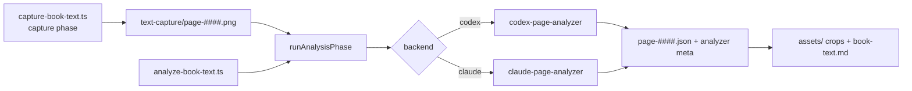

# Reprocess Captured Pages and Claude Code CLI Backend Design

Date: 2026-09-01
Status: Approved for implementation (autonomous session; assumptions listed below)
Related: [Codex CLI Book Processing Design](./2026-08-27-codex-cli-book-processing-design.md), `.superpowers/sdd/capture-script-report.md`

## Purpose

The screenshot pipeline (`src/capture-book-text.ts`) has two phases:

1. **Capture** — drive the Kindle web reader and save every page as `out/<ASIN>/text-capture/page-####.png`.
2. **Analysis** — send each page PNG to a multimodal CLI (today: `codex exec`), persist the structured `{ text, visuals }` result as `page-####.json`, crop the visuals into `text-capture/assets/`, and assemble `out/<ASIN>/book-text.md`.

Today the analysis phase only runs as the tail of the capture script (`OCR=1`), it always reuses any existing `page-####.json`, and it only knows how to talk to the Codex CLI. This design adds:

- A standalone way to run **only the analysis phase** against pages that are already on disk, with an explicit option to **reprocess** pages that already have results (all pages, or a chosen subset).
- A second analysis backend, the **Claude Code CLI** (`claude -p`), selectable per run, alongside Codex.

## Scope

- New entry point `src/analyze-book-text.ts` that runs the analysis phase for one ASIN without launching a browser.
- Shared, testable analysis-phase module extracted from `capture-book-text.ts`; the capture script keeps its `OCR=1` behaviour by calling the shared module.
- Backend abstraction with two implementations: Codex CLI (existing behaviour, moved) and Claude Code CLI (new).
- Per-page result metadata recording which backend/model/effort produced it.
- Configuration through environment variables, matching the rest of the repository.
- Unit tests using fake CLI fixtures; no real model calls in the standard test suite.
- README and `.env.example` updates.

## Non-goals

- No changes to `transcribe-book-content.ts` / the batch scheduler pipeline. That pipeline depends on `metadata.json` from `extract-kindle-book.ts`, whose Amazon endpoints no longer work; the user's books live under `text-capture/`.
- No change to the capture phase, the page prompt, the output schema, the crop logic, or the `book-text.md` format.
- No parallel page analysis (both CLIs are run one page at a time, as today).
- No automatic migration or backup of previous results beyond what is described under "Reprocess semantics".

## Approaches considered

1. **Flags on the capture script** (`SKIP_CAPTURE=1 REPROCESS=1`). Smallest diff, but `capture-book-text.ts` is already 1,100 lines with the browser launch woven through `main()`, and the analysis code would stay untestable.
2. **Standalone analysis script plus a shared module** (chosen). Extract the analysis phase into `src/book-processing/`, give it a small backend interface, and add a thin `analyze-book-text.ts` entry point. The capture script shrinks and both entry points share one implementation.
3. **Fold into the batch-scheduler pipeline**. Rejected: different inputs (`metadata.json`), different schema, and the extractor that feeds it is broken.

## Architecture



### Modules

- `src/book-processing/page-analysis.ts` — the phase. Owns the prompt, the output schema, the `PageResult` types, lenient parsing/coercion, `runAnalysisPhase()`, page selection parsing, `renderPageSection()` and `cropVisual()` (moved verbatim from the capture script).
- `src/book-processing/codex-page-analyzer.ts` — `createCodexPageAnalyzer()`. Moves the existing `codex exec` invocation unchanged (`--ephemeral --ignore-user-config --ignore-rules --skip-git-repo-check --sandbox read-only --image … --output-schema … --output-last-message … --json -c model_reasoning_effort=…`). Preflight reuses `inspectCodexInstallation()`.
- `src/book-processing/claude-page-analyzer.ts` — `createClaudePageAnalyzer()`. New.
- `src/book-processing/analyzer-config.ts` — reads `ANALYZER`, `REPROCESS`, `PAGES`, and the per-backend env vars; builds the analyzer.
- `src/analyze-book-text.ts` — entry point.
- `src/capture-book-text.ts` — capture only, plus a call into the shared phase when `OCR=1`.

### Backend interface

```ts
interface PageAnalyzer {
  backend: 'codex' | 'claude'
  /** One-line description for logs (binary, model, effort, timeout). */
  describe(): string
  /** Verifies the CLI is installed and authenticated; throws a clear error otherwise. */
  preflight(): Promise<void>
  /** Analyzes one absolute page PNG path and returns the parsed result. Throws on failure. */
  analyzePage(pngPathAbs: string): Promise<PageResult>
  /** Metadata stamped into each page JSON this analyzer produces. */
  identity: { backend; model: string | null; effort: string | null }
}
```

### Claude Code CLI invocation

```
claude -p
  --output-format json
  --json-schema <schema JSON, inline>
  --tools Read --allowedTools Read --permission-mode dontAsk
  --add-dir <absolute directory containing the page PNG>
  --safe-mode --strict-mcp-config --no-session-persistence
  [--model <CLAUDE_CLI_MODEL>] [--effort <CLAUDE_CLI_EFFORT>]
  "<page-analysis prompt> … The page image is at <absolute path>. Read it with the Read tool, then answer."
```

- Spawned with `shell: false`, stdin closed, `cwd` set to a private temporary directory, stdout/stderr byte-capped, `SIGTERM` then `SIGKILL` on timeout (same discipline as the Codex runner).
- `--safe-mode` disables CLAUDE.md discovery, hooks, plugins, MCP servers and other customizations so the run is fast and independent of the operator's Claude Code setup. Auth, model selection and built-in tools still work.
- Output is one JSON `result` object on stdout. Success requires exit code 0, `is_error === false`, and `subtype === 'success'`. The page result is taken from `structured_output` when present, otherwise parsed from the `result` string (with fenced-JSON recovery), otherwise treated as plain text with no visuals, mirroring the Codex parser.
- Preflight runs `claude --version` and `claude auth status` (JSON; requires `loggedIn: true`). When not logged in the error tells the operator to run `claude auth login`.

### Reprocess semantics

- Default (no `REPROCESS`): resume. Pages with a readable `page-####.json` are reused; pages without one are analyzed.
- `REPROCESS=1`: every eligible page is re-analyzed even when a cached JSON exists.
- `PAGES=1-20,45`: restricts which pages may hit the model. Pages outside the selection reuse their cached JSON if present and are otherwise skipped with a warning (they are omitted from `book-text.md` until analyzed).
- Each page gets up to 3 attempts with linear backoff (3 s, 6 s). An analyzer can mark a failure as not retryable (`PageAnalysisError.retryable === false`, e.g. a rejected `--model` or an authentication error, classified with the Codex runner's `classifyServiceFailure`) so the page fails at once instead of wasting retries.
- A cached JSON is only replaced after a successful analysis; a failed page keeps its previous result, and the failed page numbers are listed in the final summary.
- A page with no result (failed with nothing cached, or excluded by `PAGES` with nothing cached) is never silently dropped: `book-text.md` gets a flagged gap section that embeds the preserved full-page image (ported from upstream commit c75afea). No JSON is written for it, so a rerun retries it.
- `book-text.md` and the crops are always rebuilt from the per-page JSON, exactly as today.

### Page JSON format

Unchanged fields plus an optional `analyzer` object:

```json
{
  "text": "…",
  "visuals": [ … ],
  "analyzer": {
    "backend": "claude",
    "model": null,
    "effort": "high",
    "analyzedAt": "2026-09-01T18:00:00.000Z"
  }
}
```

`model: null` means the CLI's default model was used. Existing files without `analyzer` remain valid.

### Configuration

| Variable | Default | Meaning |
| --- | --- | --- |
| `ASIN` | required | Book to analyze (`out/<ASIN>/text-capture`). |
| `ANALYZER` | `codex` | `codex` or `claude`. |
| `REPROCESS` | unset | `1`/`true` re-analyzes pages that already have results. |
| `PAGES` | all | Comma list of page numbers / ranges eligible for analysis. |
| `CODEX_BIN`, `CODEX_MODEL`, `CODEX_REASONING_EFFORT` (`xhigh`), `CODEX_TIMEOUT_MS` (`300000`) | as today | Codex backend. |
| `CLAUDE_CLI_BIN` (`claude`), `CLAUDE_CLI_MODEL`, `CLAUDE_CLI_EFFORT` (`high`), `CLAUDE_CLI_TIMEOUT_MS` (`300000`) | new | Claude backend. |

`CLAUDE_CLI_EFFORT` defaults to `high` rather than `xhigh` because effort levels above `high` are model-dependent; the operator can raise it explicitly.

### Logging

All analysis-phase logs use the `[analyze]` prefix. At startup the phase logs the backend description, reprocess/selection settings, and counts (page PNGs found, cached results, pages to analyze). Each page logs whether it was reused, analyzed (with duration), or failed (with the sanitized error). The summary reports analyzed/reused/failed/skipped counts, the failed page numbers, and the output path. `analyze-book-text.ts` exits with status 1 when any page failed so the failure is visible to automation.

### Error handling

- Missing capture directory or zero page PNGs: fail fast with the expected path.
- Preflight failure: fail fast before touching any page.
- Per-page failure: retry when retryable, then log, keep going, keep the old JSON (or emit a gap section), report at the end.
- Invalid configuration (`ANALYZER` outside the enum, malformed `PAGES`, non-integer timeouts): throw at startup with the variable name.

### Testing

- `test/fixtures/fake-claude.mjs` emulates `claude --version`, `claude auth status`, and `claude -p` with scenarios (success with `structured_output`, JSON only in `result`, `is_error`, non-zero exit, hang, not logged in).
- `test/fixtures/fake-codex.mjs` gains a `page-analysis` scenario that writes a `{ text, visuals }` result file.
- `test/book-processing/page-analysis.test.ts` drives `runAnalysisPhase()` with an in-memory analyzer: resume, reprocess, page selection, failure keeps cache, analyzer metadata, markdown assembly, selection parsing.
- `test/book-processing/claude-page-analyzer.test.ts` and `codex-page-analyzer.test.ts` verify argument construction, output parsing, and failure paths against the fakes.
- `test/book-processing/analyzer-config.test.ts` verifies env parsing.
- Standard tests never invoke a real CLI or need credentials.

## Assumptions made in this session

- The active pipeline is `capture-book-text.ts` (all `out/<ASIN>/` directories contain `text-capture/`, none contain `pages/`), so the `transcribe-book-content.ts` pipeline is left untouched.
- The `claude` CLI on this machine is currently not authenticated (`claude auth status` reports `loggedIn: false`), so the Claude backend was verified against the fake fixture and the documented CLI contract, not a live run. The first real run should be a small `PAGES=1-2` smoke test.
